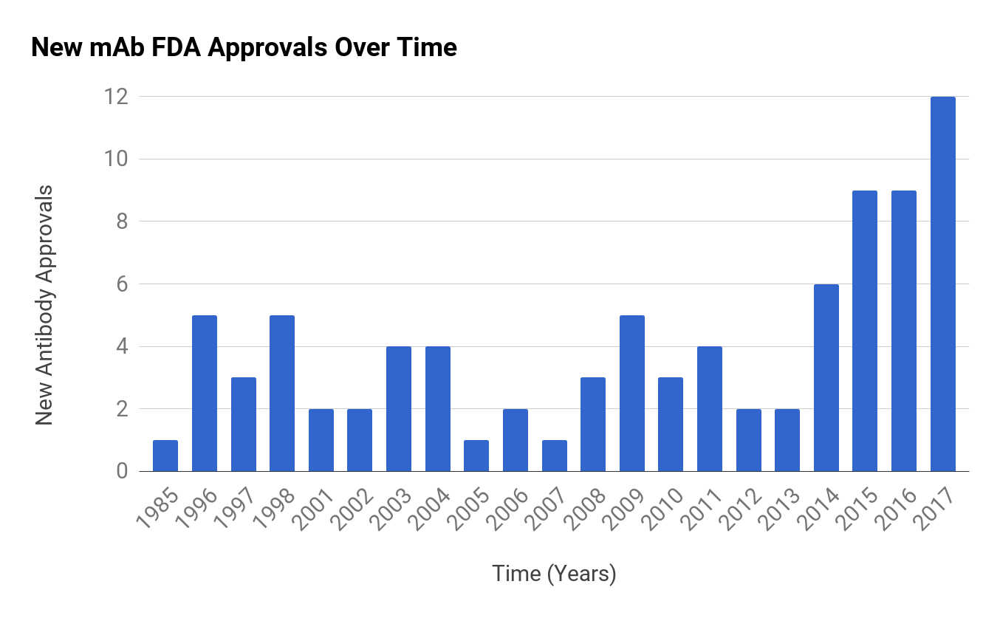

## FDA Approved Antibodies

| [OfficialName](../wiki/) | Name | [Target](../wiki/target_list) | [Indication](../wiki/indication_list) | [Original Approval](../wiki/approval_year) |
|---|---|---|---|---|
| [ORTHOCLONE OKT3](../wiki/ORTHOCLONE_OKT3) | Muromonab CD3 | [CD3](../wiki/CD3) | [Transplants](../wiki/indication_Transplants) | 1985 |
| [CEA-SCAN](../wiki/CEA-SCAN) | Arcitumomab | [CD66(CEA)](../wiki/CD66(CEA)) | [Cancer](../wiki/indication_Cancer) | 1996 |
| [MYOSCINT](../wiki/MYOSCINT) | Imciromab | [CardiacMyosin](../wiki/CardiacMyosin) | [Other](../wiki/indication_Other) | 1996 |
| [MYLOTARG](../wiki/MYLOTARG) | Gemtuzumab ozogamicin | [CD33](../wiki/CD33) | [Cancer](../wiki/indication_Cancer) | 2000 |
| [PROSTASCINT](../wiki/PROSTASCINT) | Capromab pendetide | [PSMA](../wiki/PSMA) | [Cancer](../wiki/indication_Cancer) | 1996 |
| [VERLUMA](../wiki/VERLUMA) | Nofetumomab merpentan | [EpCAM+CD20](../wiki/EpCAM+CD20) | [Cancer](../wiki/indication_Cancer) | 1996 |
| [REOPRO](../wiki/REOPRO) | Abciximab | [CD41(Integrin-α2β)](../wiki/CD41(Integrin-α2β)) | [Other](../wiki/indication_Other) | 1997 |
| [RITUXAN](../wiki/RITUXAN) | Rituximab | [CD20](../wiki/CD20) | [Autoimmunity + Cancer](../wiki/indication_Autoimmunity + Cancer) | 1997 |
| [ZENPAX](../wiki/ZENPAX) | Daclizumab | [CD25(IL-2Rα)](../wiki/CD25(IL-2Rα)) | [Transplants](../wiki/indication_Transplants) | 1997 |
| [ENBREL](../wiki/ENBREL) | Etanercept | [TNFα](../wiki/TNFα) | [Autoimmunity](../wiki/indication_Autoimmunity) | 1998 |
| [HERCEPTIN](../wiki/HERCEPTIN) | Trastuzumab | [CD340(HER2)](../wiki/CD340(HER2)) | [Cancer](../wiki/indication_Cancer) | 1998 |
| [REMICADE](../wiki/REMICADE) | Infliximab | [TNFα](../wiki/TNFα) | [Autoimmunity](../wiki/indication_Autoimmunity) | 1998 |
| [SIMULECT](../wiki/SIMULECT) | Basiliximab | [CD25(IL-2Rα)](../wiki/CD25(IL-2Rα)) | [Transplants](../wiki/indication_Transplants) | 1998 |
| [SYNAGIS](../wiki/SYNAGIS) | Palivizumab | [Fprotein(RSV)](../wiki/Fprotein(RSV)) | [Infection](../wiki/indication_Infection) | 1998 |
| [LEMTRADA](../wiki/LEMTRADA) | Alemtuzumab | [CD52](../wiki/CD52) | [Cancer](../wiki/indication_Cancer) | 2001 |
| [CAMPATH](../wiki/CAMPATH) | Alemtuzumab | [CD52](../wiki/CD52) | [Autoimmunity](../wiki/indication_Autoimmunity) | 2001 |
| [HUMIRA](../wiki/HUMIRA) | Adalimumab | [TNFα](../wiki/TNFα) | [Autoimmunity](../wiki/indication_Autoimmunity) | 2002 |
| [ZEVALIN](../wiki/ZEVALIN) | Ibritumomab tiuxetan | [CD20](../wiki/CD20) | [Cancer](../wiki/indication_Cancer) | 2002 |
| [AMEVIVE](../wiki/AMEVIVE) | Alefacept | [CD2](../wiki/CD2) | [Autoimmunity](../wiki/indication_Autoimmunity) | 2003 |
| [BEXXAR](../wiki/BEXXAR) | Tositumomab | [CD20](../wiki/CD20) | [Cancer](../wiki/indication_Cancer) | 2003 |
| [RAPTIVA](../wiki/RAPTIVA) | Efalizumab | [CD11a(LFA-1)](../wiki/CD11a(LFA-1)) | [Autoimmunity](../wiki/indication_Autoimmunity) | 2003 |
| [XOLAIR](../wiki/XOLAIR) | Omalizumab | [IgE-Fc](../wiki/IgE-Fc) | [Autoimmunity](../wiki/indication_Autoimmunity) | 2003 |
| [NEUTROSPEC](../wiki/NEUTROSPEC) | fanolesomab | [CD15](../wiki/CD15) | [Other](../wiki/indication_Other) | 2004 |
| [AVASTIN](../wiki/AVASTIN) | Bevacizumab | [VEGF-A](../wiki/VEGF-A) | [Cancer](../wiki/indication_Cancer) | 2004 |
| [ERBITUX](../wiki/ERBITUX) | Cetuximab | [EGFR](../wiki/EGFR) | [Cancer](../wiki/indication_Cancer) | 2004 |
| [TYSABRI](../wiki/TYSABRI) | Natalizumab | [Integrin-α4](../wiki/Integrin-α4) | [Autoimmunity](../wiki/indication_Autoimmunity) | 2004 |
| [ORENCIA](../wiki/ORENCIA) | Abatacept | [CD80+CD86](../wiki/CD80+CD86) | [Autoimmunity](../wiki/indication_Autoimmunity) | 2005 |
| [LUCENTIS](../wiki/LUCENTIS) | Ranibizumab | [VEGF-A](../wiki/VEGF-A) | [Other](../wiki/indication_Other) | 2006 |
| [VECTIBIX](../wiki/VECTIBIX) | Panitumumab | [EGFR](../wiki/EGFR) | [Cancer](../wiki/indication_Cancer) | 2006 |
| [SOLIRIS](../wiki/SOLIRIS) | Eculizumab | [C5](../wiki/C5) | [Other](../wiki/indication_Other) | 2007 |
| [ARCALYST](../wiki/ARCALYST) | Rilonacept | [IL-1](../wiki/IL-1) | [Other](../wiki/indication_Other) | 2008 |
| [CIMZIA](../wiki/CIMZIA) | Certolizumab pegol | [TNFα](../wiki/TNFα) | [Autoimmunity](../wiki/indication_Autoimmunity) | 2008 |
| [NPLATE](../wiki/NPLATE) | Romiplostim | [CD110](../wiki/CD110) | [Other](../wiki/indication_Other) | 2008 |
| [ARZERRA](../wiki/ARZERRA) | Ofatumumab | [CD20](../wiki/CD20) | [Cancer](../wiki/indication_Cancer) | 2009 |
| [ILARIS](../wiki/ILARIS) | Canakinumab | [IL-1b](../wiki/IL-1b) | [Other](../wiki/indication_Other) | 2009 |
| [REMOVAB](../wiki/REMOVAB) | Catumaxomab | [EpCAM+CD3](../wiki/EpCAM+CD3) | [Cancer](../wiki/indication_Cancer) | 2009 EMA |
| [SIMPONI](../wiki/SIMPONI) | Golimumab | [TNFα](../wiki/TNFα) | [Autoimmunity](../wiki/indication_Autoimmunity) | 2009 |
| [SIMPONI ARIA](../wiki/SIMPONI_ARIA) | Golimumab | [TNFα](../wiki/TNFα) | [Autoimmunity](../wiki/indication_Autoimmunity) | 2009 |
| [STELARA](../wiki/STELARA) | Ustekinumab | [IL-12+IL-23](../wiki/IL-12+IL-23) | [Autoimmunity](../wiki/indication_Autoimmunity) | 2009 |
| [ACTEMRA](../wiki/ACTEMRA) | Tocilizumab | [CD126(IL-6R)](../wiki/CD126(IL-6R)) | [Autoimmunity + Cancer](../wiki/indication_Autoimmunity + Cancer) | 2010 |
| [PROLIA](../wiki/PROLIA) | Denosumab | [CD254(RANKL)](../wiki/CD254(RANKL)) | [Other](../wiki/indication_Other) | 2010 |
| [XGEVA](../wiki/XGEVA) | Denosumab | [CD254(RANKL)](../wiki/CD254(RANKL)) | [Cancer](../wiki/indication_Cancer) | 2010 |
| [ADCETRIS](../wiki/ADCETRIS) | Brentuximab vedotin | [CD30(TNFRSF8)](../wiki/CD30(TNFRSF8)) | [Cancer](../wiki/indication_Cancer) | 2011 |
| [BENLYSTA](../wiki/BENLYSTA) | Belimumab | [CD257(BAFF)](../wiki/CD257(BAFF)) | [Autoimmunity](../wiki/indication_Autoimmunity) | 2011 |
| [NULOJIX](../wiki/NULOJIX) | Belatacept | [CD80+CD86](../wiki/CD80+CD86) | [Transplants](../wiki/indication_Transplants) | 2011 |
| [YERVOY](../wiki/YERVOY) | Ipilimumab | [CD152(CTLA-4)](../wiki/CD152(CTLA-4)) | [Cancer](../wiki/indication_Cancer) | 2011 |
| [PERJETA](../wiki/PERJETA) | Pertuzumab | [CD340(HER2)](../wiki/CD340(HER2)) | [Cancer](../wiki/indication_Cancer) | 2012 |
| [RAXIBACUMAB](../wiki/RAXIBACUMAB) | Raxibacumab | [Anthrax](../wiki/Anthrax) | [Infection](../wiki/indication_Infection) | 2012 |
| [GAZYVA](../wiki/GAZYVA) | Obinutuzumab | [CD20](../wiki/CD20) | [Cancer](../wiki/indication_Cancer) | 2013 |
| [KADCYLA](../wiki/KADCYLA) | Ado Trastuzumab emtansine | [CD340(HER2)](../wiki/CD340(HER2)) | [Cancer](../wiki/indication_Cancer) | 2013 |
| [BLINCYTO](../wiki/BLINCYTO) | Blinatumomab | [CD19+CD3](../wiki/CD19+CD3) | [Cancer](../wiki/indication_Cancer) | 2014 |
| [CYRAMZA](../wiki/CYRAMZA) | Ramucirumab | [VEGFR2](../wiki/VEGFR2) | [Cancer](../wiki/indication_Cancer) | 2014 |
| [ENTYVIO](../wiki/ENTYVIO) | Vedolizumab | [Integrin-α4β7](../wiki/Integrin-α4β7) | [Autoimmunity](../wiki/indication_Autoimmunity) | 2014 |
| [KEYTRUDA](../wiki/KEYTRUDA) | Pembrolizumab | [CD279(PD-1)](../wiki/CD279(PD-1)) | [Cancer](../wiki/indication_Cancer) | 2014 |
| [OPDIVO](../wiki/OPDIVO) | Nivolumab | [CD279(PD-1)](../wiki/CD279(PD-1)) | [Cancer](../wiki/indication_Cancer) | 2014 |
| [SYLVANT](../wiki/SYLVANT) | Siltuximab | [IL-6](../wiki/IL-6) | [Other](../wiki/indication_Other) | 2014 |
| [COSENTYX](../wiki/COSENTYX) | Secukinumab | [IL-17α](../wiki/IL-17α) | [Autoimmunity](../wiki/indication_Autoimmunity) | 2015 |
| [DARZALEX](../wiki/DARZALEX) | Daratumumab | [CD38](../wiki/CD38) | [Cancer](../wiki/indication_Cancer) | 2015 |
| [EMPLICITI](../wiki/EMPLICITI) | Elotuzumab | [CD319(SLAMF7)](../wiki/CD319(SLAMF7)) | [Cancer](../wiki/indication_Cancer) | 2015 |
| [NUCALA](../wiki/NUCALA) | Mepolizumab | [IL-5](../wiki/IL-5) | [Autoimmunity](../wiki/indication_Autoimmunity) | 2015 |
| [PORTRAZZA](../wiki/PORTRAZZA) | Necitumumab | [EGFR](../wiki/EGFR) | [Cancer](../wiki/indication_Cancer) | 2015 |
| [PRALUENT](../wiki/PRALUENT) | Alirocumab | [PCSK9](../wiki/PCSK9) | [Other](../wiki/indication_Other) | 2015 |
| [PRAXBIND](../wiki/PRAXBIND) | Idarucizumab | [Dabigatran](../wiki/Dabigatran) | [Other](../wiki/indication_Other) | 2015 |
| [REPATHA](../wiki/REPATHA) | Evolocumab | [PCSK9](../wiki/PCSK9) | [Other](../wiki/indication_Other) | 2015 |
| [UNITUXIN](../wiki/UNITUXIN) | Dinutuximab | [GD2](../wiki/GD2) | [Cancer](../wiki/indication_Cancer) | 2015 |
| [ZINBRYTA](../wiki/ZINBRYTA) | Daclizumab | [CD25(IL-2Rα)](../wiki/CD25(IL-2Rα)) | [Autoimmunity](../wiki/indication_Autoimmunity) | 2016 |
| [AMJEVITA](../wiki/AMJEVITA) | Adalimumab atto | [TNFα](../wiki/TNFα) | [Autoimmunity](../wiki/indication_Autoimmunity) | 2016 |
| [ANTHIM](../wiki/ANTHIM) | Obiltoxaximab | [Anthrax](../wiki/Anthrax) | [Infection](../wiki/indication_Infection) | 2016 |
| [CINQUAIR](../wiki/CINQUAIR) | Reslizumab | [IL-5](../wiki/IL-5) | [Autoimmunity](../wiki/indication_Autoimmunity) | 2016 |
| [INFLECTRA](../wiki/INFLECTRA) | Infliximab dyyb | [TNFα](../wiki/TNFα) | [Autoimmunity](../wiki/indication_Autoimmunity) | 2016 |
| [LARTRUVO](../wiki/LARTRUVO) | Olaratumab | [PDGFRα](../wiki/PDGFRα) | [Cancer](../wiki/indication_Cancer) | 2016 |
| [TALTZ](../wiki/TALTZ) | Ixekizumab | [IL-17α](../wiki/IL-17α) | [Autoimmunity](../wiki/indication_Autoimmunity) | 2016 |
| [TECENTRIQ](../wiki/TECENTRIQ) | Atezolizumab | [CD274(PD-L1)](../wiki/CD274(PD-L1)) | [Cancer](../wiki/indication_Cancer) | 2016 |
| [ZINPLAVA](../wiki/ZINPLAVA) | Bezlotoxumab | [Toxin-B](../wiki/Toxin-B) | [Infection](../wiki/indication_Infection) | 2016 |
| [BAVENCIO](../wiki/BAVENCIO) | Avelumab | [CD274(PD-L1)](../wiki/CD274(PD-L1)) | [Cancer](../wiki/indication_Cancer) | 2017 |
| [DUPIXENT](../wiki/DUPIXENT) | Dupliumab | [IL-4Rα](../wiki/IL-4Rα) | [Autoimmunity](../wiki/indication_Autoimmunity) | 2017 |
| [OCREVUS](../wiki/OCREVUS) | Ocrelizumab | [CD20](../wiki/CD20) | [Autoimmunity](../wiki/indication_Autoimmunity) | 2017 |
| [SILIQ](../wiki/SILIQ) | Brodalumab | [IL-17R](../wiki/IL-17R) | [Autoimmunity](../wiki/indication_Autoimmunity) | 2017 |
| [MVASI](../wiki/MVASI) | Bevacizumab awwb | [VEGF-A](../wiki/VEGF-A) | [Cancer](../wiki/indication_Cancer) | 2017 |
| [BESPONSA](../wiki/BESPONSA) | Inotuzumab ozogamicin | [CD22](../wiki/CD22) | [Cancer](../wiki/indication_Cancer) | 2017 |
| [CYLTEZO](../wiki/CYLTEZO) | Adalimumab adbm | [TNFα](../wiki/TNFα) | [Autoimmunity](../wiki/indication_Autoimmunity) | 2017 |
| [IMFINZI](../wiki/IMFINZI) | Durvalumab | [CD274(PD-L1)](../wiki/CD274(PD-L1)) | [Cancer](../wiki/indication_Cancer) | 2017 |
| [KEVZARA](../wiki/KEVZARA) | Sarilumab | [CD126(IL-6R)](../wiki/CD126(IL-6R)) | [Autoimmunity](../wiki/indication_Autoimmunity) | 2017 |
| [RENFLEXIS](../wiki/RENFLEXIS) | Infliximab abda | [TNFα](../wiki/TNFα) | [Autoimmunity](../wiki/indication_Autoimmunity) | 2017 |
| [RITUXAN HYCELA](../wiki/RITUXAN_HYCELA) | Rituximab hyaluronidase | [CD20](../wiki/CD20) | [Cancer](../wiki/indication_Cancer) | 2017 |
| [TREMFYA](../wiki/TREMFYA) | Guselkumab | [IL-23α](../wiki/IL-23α) | [Autoimmunity](../wiki/indication_Autoimmunity) | 2017 |
| [FASENRA](../wiki/FASENRA) | Benralizumab | [IL-5Rα](../wiki/IL-5Rα) | [Autoimmunity](../wiki/indication_Autoimmunity) | 2017 |
| [HEMLIBRA](../wiki/HEMLIBRA) | Emicizumab kxwh | [FactorIXa+FactorX](../wiki/FactorIXa+FactorX) | [Hemophilia](../wiki/indication_Hemophilia) | 2017 |
| [OGIVRI](../wiki/OGIVRI) | Trastuzumab dkst | [HER2](../wiki/HER2) | [Cancer](../wiki/indication_Cancer) | 2017 |
| [IXIFI](../wiki/IXIFI) | Infliximab qbtx | [TNFα](../wiki/TNFα) | [Autoimmunity](../wiki/indication_Autoimmunity) | 2017 |

##### Updated of 2017-09-24

